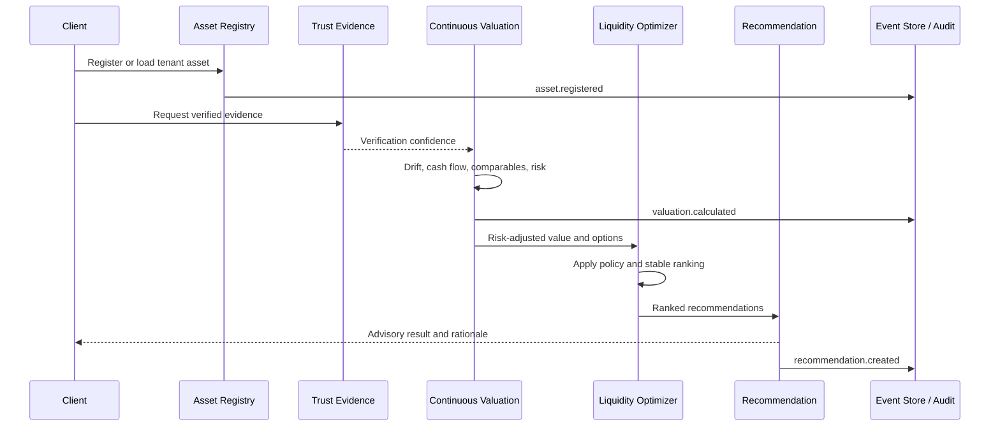

# Liquidity Intelligence Architecture

## Scope and safety boundary

Liquidity intelligence transforms collateral valuation into deterministic,
policy-constrained advisory analysis. It models financing and participation
paths but cannot execute a loan, trade, transfer, settlement, syndication, or
securities issuance.

Every operation is scoped by `X-Tenant-ID`. Identifiers do not grant access:
reads reconstruct state only from events belonging to the authenticated
tenant. API-key authorization applies to the complete route surface.

## Components

- `asset_registry.py` validates and persists supported asset records.
- `continuous_valuation.py` calculates drift, confidence intervals,
  comparable adjustments, cash-flow adjustments, and risk-adjusted value.
- `liquidity_options.py` deterministically generates financing alternatives.
- `liquidity_optimizer.py` applies policy constraints and stable scoring.
- `fractionalization.py` creates and values ownership and participation slices.
- `dynamic_collateral.py` reports LTV, health, and borrowing capacity.
- `auction_book.py` simulates a tenant-private bid/ask book and midpoint
  matching without execution.
- `revenue_streams.py` values probability-weighted future cash flows.
- `liquidity_explainer.py` produces reproducible human-readable rationale.
- `trust.py` defines the VEIL adapter boundary and fail-closed production
  policy.
- `event_store.py` appends canonical JSON events and exports audit bundles.
- `service.py` coordinates trust, valuation, optimization, and event creation.

## Determinism

Money is quantized to cents and scores to four decimal places. Canonical JSON
sorts keys and represents decimals as strings. Aggregate and event identifiers
are SHA-256-derived from canonical inputs. Ranking uses explicit numeric
weights and method name as the final stable tie-breaker.

Repeated analysis over the same persisted asset, evidence, comparables, and
policy returns the same recommendation identifier and does not duplicate the
recommendation event.

## Event model and replay

The JSONL store is append-only. Each event contains:

- Global sequence and logical time.
- Deterministic event identifier.
- Tenant identifier.
- Event type and aggregate identifier.
- Canonical payload.

Durable events cover asset registration, valuation, recommendations,
fractionalization, collateral calculations, auction orders and simulated
matches, and revenue streams. Audit bundles contain only one tenant's events
and have a deterministic bundle identifier.

## Trust policy

VEIL integration is optional through `VeilTrustAdapter`. A caller supplies a
resolver that returns verification status, confidence, and evidence
references. Development may use the local deterministic adapter. Production
does not create a stub and rejects valuation, optimization, and collateral
analysis unless verified evidence is available.

## Analysis sequence

## Collateral calculation

Collateral health combines value confidence, net cash-flow coverage,
insurance, maintenance, leverage, revenue stability, utilization, and trust.
The health score determines an advance rate between 25% and 75%. Existing
liabilities are then deducted to estimate available borrowing capacity.

## Private order-book simulation

Bids sort by highest price then insertion sequence. Asks sort by lowest price
then insertion sequence. Compatible orders match at the deterministic midpoint
price and are never submitted for execution. Historical simulated matches are
events, not settlement records.
